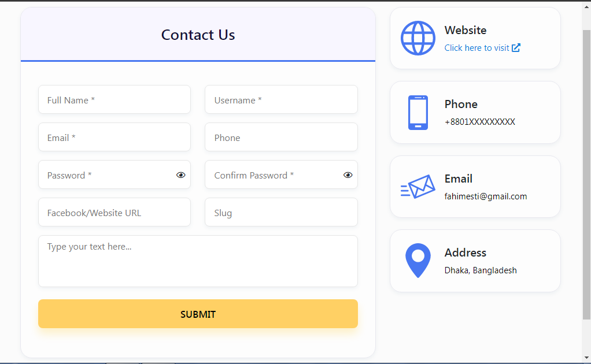

## Vanilla JS Form Validation
---
[Live Demo](https://fahimeshti.github.io/formValidationJs/)

### Features
- Validate with Regular Expression
- Field Onchange error
- Form submit error/success
- Show or hide Password



## Get started with this repo

If you want to add more feature, simply clone this repo

```
git clone https://github.com/fahimeshti/formValidationJs.git
cd form-validation-js
```